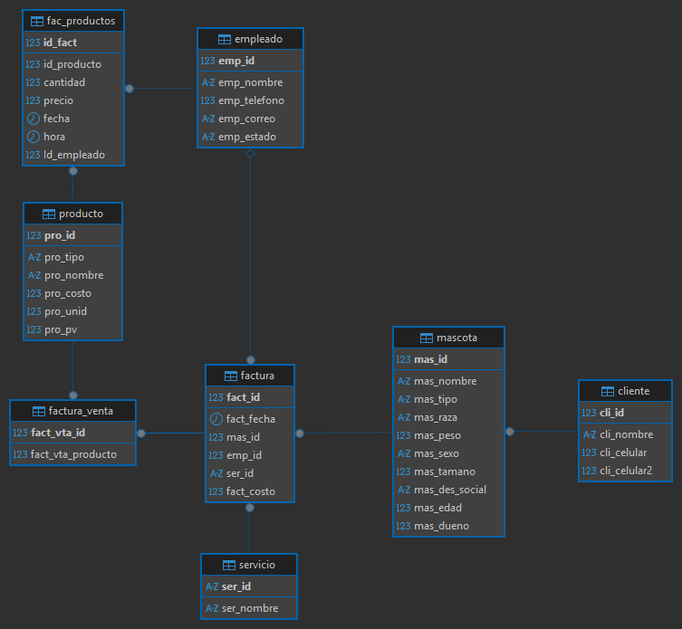

# vet-db

A persoal project built on MySQL, focused on demonstrating practical command of the relational model through SQL queries, JOINs, advanced queries, and the creation of views.

The development environment runs on Docker, using the official MySQL image to isolate and easily reproduce the database.

## Objective

Apply SQL queries, JOINs, advanced queries, and views on a relational schema designed for a veterinary clinic that manages clients, pets, employees, services, products, and invoicing.

## Repository Structure

```
vet-db/
├── veterinaria_db.sql          # Schema creation, tables, and seed data
├── veterinaria_ejercicios.sql  # Basic queries and JOINs
├── veterinaria_vws.sql         # View definitions
└── diagram_veterinaria.png     # Entity-relationship diagram with PKs and FKs
```

## Database Schema

The `veterinaria` schema includes the following tables:

- `producto` — product catalog with type, cost, stock, and sale price
- `empleado` — staff contact details and employment status
- `cliente` — clinic clients and their phone numbers
- `mascota` — pets linked to clients, with species, breed, weight, size, age, and notes
- `servicio` — available service types
- `factura` — service invoices linking pets, employees, and services
- `factura_venta` — sale invoices connected to products
- `fac_productos` — product sale history with quantity, price, date/time, and responsible employee



## Docker Setup

### 1. Start the container

```bash
docker run -d \
  --name veterinaria-mysql \
  -e MYSQL_ROOT_PASSWORD= \
  -p 3306:3306 \
  mysql:8
```

### 2. Load the schema

```bash
docker cp veterinaria_db.sql veterinaria-mysql:/veterinaria_db.sql
docker exec -i veterinaria-mysql mysql -uroot -prootpass < veterinaria_db.sql
```

### 3. Connect to the database

```bash
docker exec -it veterinaria-mysql mysql -uroot -prootpass veterinaria
```

## SQL Scripts

| File | Description |
|---|---|
| `veterinaria_db.sql` | Full DDL + seed data |
| `veterinaria_ejercicios.sql` | Basic queries, filters, and JOINs |
| `veterinaria_vws.sql` | Views for common queries |

## Tech Stack

- MySQL 8
- Docker